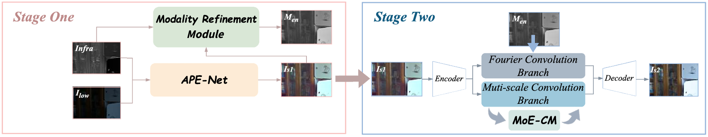
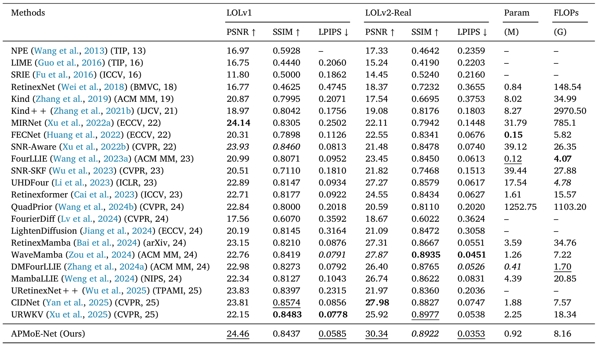

# ESWA2025-APMoENet
Complete code implementation of the ESWA 2025 paper “APMoE-Net: Fourier amplitude-phase joint enhancement and MoE compensation for low-light image enhancement.”

## Table of Contents
- [Project Structure](#project-structure)
- [Training Data](#training-data)
- [Experimental Results](#experimental-results)
- [Contact](#contact)

---

### Project Structure

APMoE-Net/  
│  
├── data/                  # Training and validation datasets  
├── experiments/           # Saved models, logs, and results  
├── models/                # Network model code  
├── options/               # Configuration files (train/test YAML)  
├── utils/                 # Utility functions  
├── train.py               # Training script  
├── test.py                # Testing/validation script  
└── README.md              # Project description  

### Training Data

The training and testing datasets used in this project include **LOLv1 infrared images**.  

- **Dataset URL:** [LOLv1 Infrared Dataset](https://pan.quark.cn/s/d61d4b3656f9)
- **Data organization example:**  
data/  
├── LOLv1/  
│ ├── eval15/ # test  
│ └── Infra/ # infrared image  
│ └── our485/ # train  

### Experimental Results

### Contact

Email: caime24@mails.jlu.edu.cn

