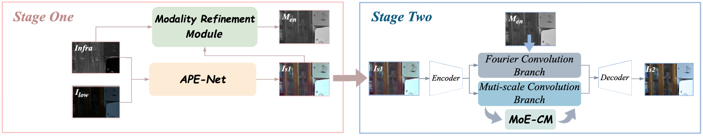
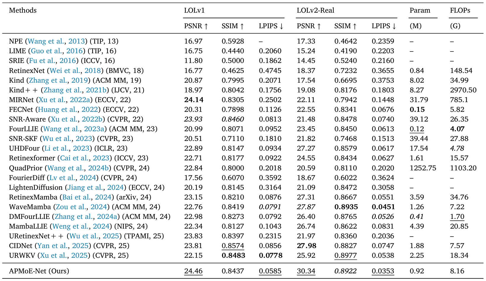

# ESWA2025-APMoENet
Complete code implementation of the ESWA 2025 paper “APMoE-Net: Fourier amplitude-phase joint enhancement and MoE compensation for low-light image enhancement.” [Paper Link](https://www.sciencedirect.com/science/article/abs/pii/S0957417425032798)

## Table of Contents
- [Project Structure](#project-structure)
- [Training Data](#training-data)
- [Experimental Results](#experimental-results)
- [Contact](#contact)

---

### 🏗️ Project Structure

APMoE-Net/  
│  
├── data/                  # Training and validation datasets  
├── experiments/           # Saved models, logs, and results  
├── models/                # Network model code  
├── options/               # Configuration files (train/test YAML)  
├── utils/                 # Utility functions  
├── train.py               # Training script  
├── test.py                # Testing/validation script  
└── README.md              # Project description  

### 📂 Training Data

The training and testing datasets used in this project include **LOLv1 infrared images**.  

- **Infrared Dataset URL:** [Quark Cloud Drive](https://pan.quark.cn/s/d61d4b3656f9) | [Google Drive](https://drive.google.com/drive/folders/1iul-HAX2tDyww6pCxEAHdP417idcQ9IA)
- **Data organization example:**  
data/  
├── LOLv1/  
│ ├── eval15/ # test  
│ └── Infra/ # infrared image  
│ └── our485/ # train  

### 📊 Experimental Results


### 📚 Citation

If you find our work helpful, please consider citing our paper:

```bibtex
@article{cai2025apmoe,
  title={APMoE-Net: Fourier Amplitude-Phase Joint Enhancement and MoE Compensation for Low-Light Image Enhancement},
  author={Cai, Mengen and Zhang, Tongshun and Liu, Pingping and Zhou, Qiuzhan},
  journal={Expert Systems with Applications},
  pages={129664},
  year={2025},
  publisher={Elsevier}
}
```
### ✉ Contact

Email: caime24@mails.jlu.edu.cn

